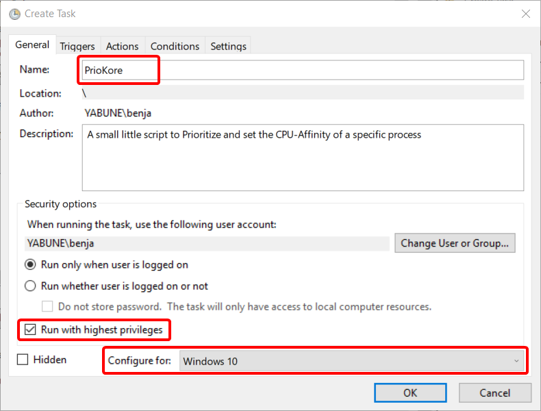
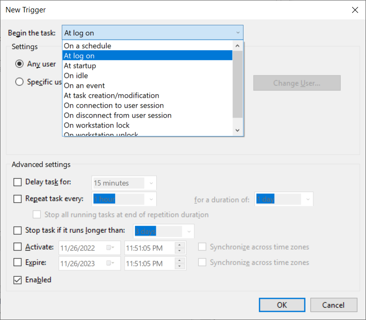
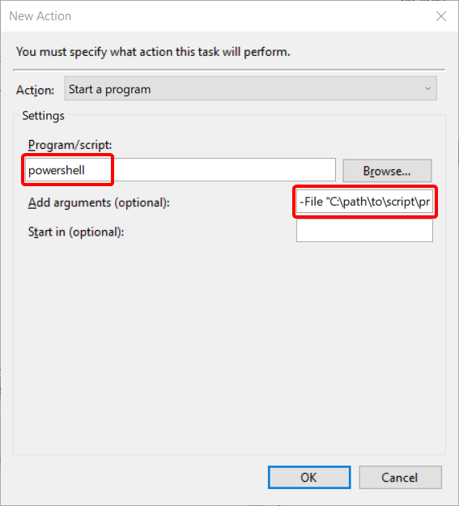

# priokore
A small little script to Prioritize and set the CPU-Affinity of a specific process 

I created this mainly to fix Voicemeeter lagging and crackling.
Currently it sets the **"audiodg.exe"** Process to **priority "High"** and pins it to the **Thread with Index "2"**

It can either be launched manually or automatically by creating a "Start after Log on"-Task in the **Task Scheduler** (recommended) or by putting it into `shell:startup`.

## Installation

#### Task Scheduler 

> To make this work properly **please change the Powershell Excecution-Policy** to allow local scripts. 
> To do this follow one of these guides:
> - https://www.itechtics.com/enable-script-execution-powershell/#how-to-allow-scripts-to-run-in-powershell
> - https://windowsloop.com/enable-powershell-scripts-execution-windows-10/

1. Open the Start-Menu by pressing the Windows-Button, write "Task Scheduler" and open it
2. On the right, click on "Create Task"
3. Give this Task a Name like "PrioKore" in the first field on top
4. On this same page check the "Run with highest privileges" Box
5. Then for "Configure for" select "Windows 10"
6. Now it should look like this:

7. Now in the "Trigger"-Tab, click on "New" 
8. In this new Window you must select "At log on", then click "Ok"

9. Now in the "Actions"-Tab, click on "New"
10. As "Program/script" insert `powershell`
11. As "Add arguments" insert `-File "C:\path\to\script\priokore.ps1"` (obviously insert your own path here)

12. After all this click on "Ok" to finish creating this Task

#### Shell Startup
> Using this method the Script may, depending on your Windows settings, ask for permission every time you start your PC
1. Press Win + R, write `shell:startup` and click "ok"
2. Simply put the `.ps1`-Script or a Link to it into this Folder